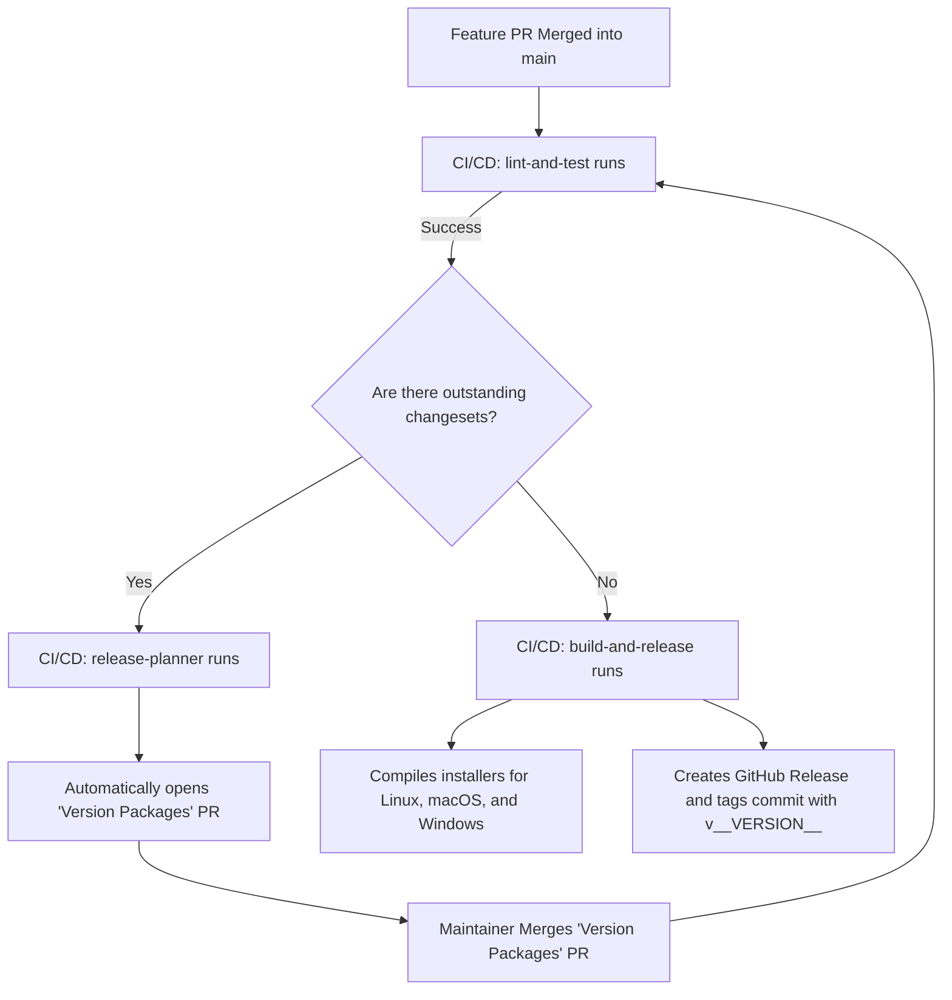

# Contribution Guide and Workflow

This document defines the technical standards and development process to ensure a clean Git history, automatic versioning, and a robust architecture.

## 1. Branching Strategy (GitHub Flow)

To protect the stability of the project, the `main` branch is protected and does not accept direct changes.

* **`main`**: Contains exclusively stable and production-ready code.
* **Feature branches (`feat/story-X`)**: For new features based on User Stories.
* **Fix branches (`fix/error-description`)**: To solve specific bugs.

### Golden Rules:

* Every change must go through a **Pull Request (PR)** before being integrated into `main`.
* The use of **Squash Merge** is recommended to maintain a linear and clean history in `main`.

---

## 2. Commit Standard (Conventional Commits)

We use the *Conventional Commits* standard to facilitate automatic generation of changelogs and version calculation.

### Structure: `<type>(scope): <description>`

* **`feat`**: A new feature (e.g., `feat(ui): add folder selector`).
* **`fix`**: A bug fix (e.g., `fix(db): solve unexpected closure`).
* **`docs`**: Changes in documentation.
* **`chore`**: Maintenance or configuration tasks (e.g., `chore: configure husky`).
* **`refactor`**: Code changes that do not add features or fix bugs.
* **`test`**: Add or fix unit tests.

> **Note:** If a change breaks backward compatibility, add a `!` after the type (e.g., `feat!: change in save format`).

---

## 3. Step-by-Step Development Process

### Step 1: Branch Creation

```bash
git checkout -b feat/story-X
```

### Step 2: Development and Commits

Make your changes following the commit standard. The system (Husky + Commitlint) will validate your messages automatically.

### Step 3: Change Registration (Changeset)

Before opening your Pull Request or merging, you must document the impact of your change for automated versioning:

```bash
npx changeset
```
*(Alternatively, you can run `npm run create-changeset`)*

1. Select the affected package (e.g., `chil`).
2. Define if it is a **patch** change (bugfix), **minor** (feature), or **major** (breaking change).
3. Write a short summary of changes for `CHANGELOG.md`.

### Step 4: Pull Request and Merge

1. Commit the generated changeset file in your feature branch:
   ```bash
   git add .changeset/
   git commit -m "chore: add changeset"
   ```
2. Upload your branch and open a PR on GitHub.
3. Once approved and after passing the automated CI checks, perform a **Squash Merge** to `main`. 

---

## 4. Automated Versioning and Releases

Versioning follows the **SemVer** standard (Major.Minor.Patch). In the current phase of initial development, we use the **0.x.y** series. 

The entire release process is fully automated via our **GitHub Actions CI/CD Pipeline**, eliminating the need for manual versioning, changelog generation, or manual tagging on the `main` branch.

### Release Workflow

The automated release workflow runs on every push or merge to the `main` branch:



1. **Automatic Pull Request Generation ("Version Packages")**:
   - When a feature branch with a changeset file is merged into `main`, the `release-planner` job is triggered.
   - It automatically consumes the changeset files, increments version numbers in `package.json` and `tauri.conf.json` using `npm run version-packages`, generates/updates `CHANGELOG.md`, and opens a special **"Version Packages" Pull Request** on GitHub.

2. **Publishing the Release**:
   - A maintainer reviews and merges this **"Version Packages" Pull Request**.
   - Upon merge, the `build-and-release` job runs. Since no outstanding changesets remain, it compiles the optimized installers for all platforms (`ubuntu-latest`, `macos-latest`, `macos-15-intel`, and `windows-latest`) using `tauri-action`.
   - It then automatically creates a **GitHub Release**, uploads the compiled installers (e.g., `.deb`, `.app`, `.exe`), and tags the commit with the new version (e.g., `v0.5.0`).

