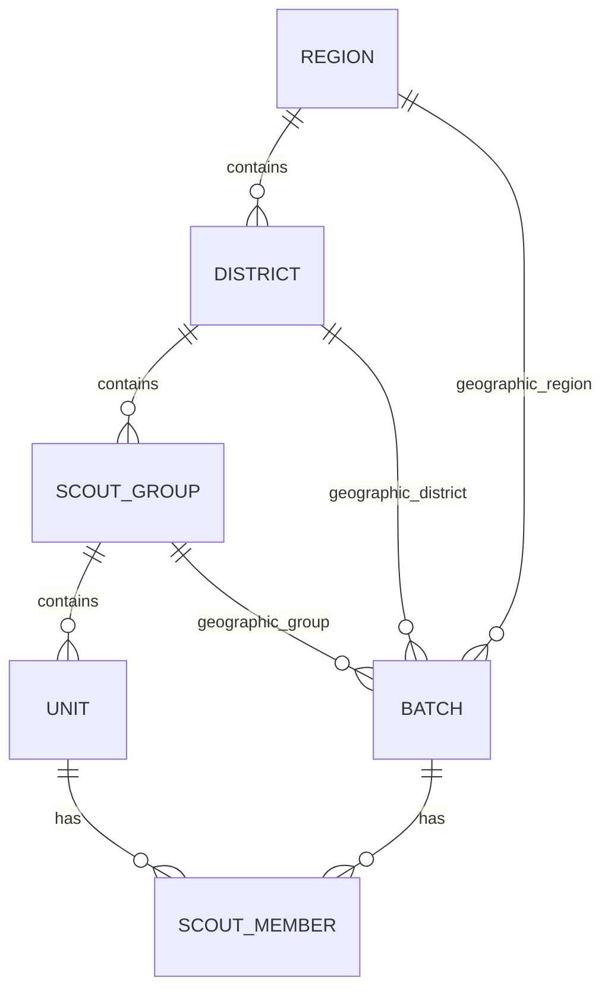

# Active Engineering Context: Chil

Welcome to the active developer context for **Chil**. This document serves as the live handover file between engineering agent sessions. Keep it concise, high-level, and accurate. 

> [!IMPORTANT]
> **DO NOT write micro-task checklists or commit lists here.** Keep this file focused on architectural milestones, schemas, interfaces, and design decisions.

---

## 1. Current Engineering State

* **Frontend (`src/`)**: 100% functional React 19 single-page-app with client-side routing under `react-router-dom`. Features a premium persistent layout, statistical dashboards, a cascading hierarchy selection form, and parallel scraping status checks.
* **Módulo de Nuevo Lote Wizard & Views (`src/features/batches`)**:
  * **Step 1 (Organización)**: Cascading selection logic for Regions, Districts, and Groups. Form validation with Zod and React Hook Form.
  * **Step 2 (Miembros & Verificación)**: Bulk verification via parallel async scraping calls (`get_member_status`). Commits successful active scouts to SQLite (`create_member` / `update_member`) and flags pending registrations.
  * **Step 3 (Revisión)**: Search filters, validation tab sorting, and manual edit modal allowing correction of member records.
  * **Pantalla de Éxito & Detalles**: KPI metrics dashboards, alert indicators for pending items, and premium PDF report generation (`generate_batch_report`).
* **Backend (`src-tauri/`)**: Fully integrated. Database CRUD commands successfully sync batch identifiers (`batch_id`) on scraped members in SQLite.

---

## 2. Active Database Schema & Models

Our local SQLite schema (`sqlite.db`) is structured relationally using SeaORM:

* **`region`**: National scout organizational regions.
* **`district`**: Regional scout districts.
* **`scout_group`**: Local groups within districts.
* **`unit`**: Section groups (e.g. Lobatos, Scouts, Rovers).
* **`scout_member`**: Individual scout registrations including personal identity data (cédula), full name, dates, status, unit/group references, and optional `batch_id` foreign key.
* **`batch`**: Batches submitted to the registry, linking to Region, District, Group, and grouping members.

---

## 3. Implemented IPC Commands Surface

Below are the active Tauri IPC commands exposed to the frontend:

### Scraper Commands (`commands/scraper.rs`)
*   `login(email, password) -> Result<(), String>`: Authenticates reqwest cookie session with external scout registry.
*   `get_member_status(cedula) -> Result<MemberDetails, String>`: Scrapes and returns member profile status from the registry.

### Scout Member CRUD Commands (`commands/member.rs`)
*   `create_member(member_data) -> Result<ScoutMember, String>`
*   `get_member(identity) -> Result<Option<ScoutMember>, String>`
*   `get_all_members() -> Result<Vec<ScoutMember>, String>`
*   `update_member(member_data) -> Result<ScoutMember, String>`
*   `delete_member(identity) -> Result<u64, String>` (returns rows affected)

### Batch Commands (`commands/batch.rs`)
*   `get_hierarchy_data() -> Result<HierarchyData, String>`: Returns full pre-structured Region -> District -> Group data tree.
*   `create_batch(name, region_id, district_id, group_id) -> Result<Batch, String>`: Inserts a new batch and auto-assigns active members of that group to it.

### PDF Commands (`commands/pdf.rs`)
*   `generate_batch_report(batch_id, output_path) -> Result<String, String>`: Formats and prints a multi-page PDF batch report to `output_path`.

---

## 4. Key Design Decisions

1.  **Scraper Session Persistence**: The reqwest client is constructed with cookie jars enabled and managed directly inside the Tauri `AppState` struct (`main.rs`). This maintains an authenticated session across sequential front-end command calls.
2.  **Decoupled Service Layers**: All services under `src-tauri/src/services/` accept raw references to `&DatabaseConnection`. This guarantees that database unit tests can mock all transactions easily using `sea-orm::MockDatabase`.
3.  **Dynamic PDF Reports**: Built-in Helvetica fonts with custom Spanish glyph sanitizers prevent PDF encoding failures while keeping executable sizes small. Supporting sequential Mock database queries and execution results ensures 100% test coverage.
4.  **Scraper Redirect Detection & Database Upserts**: Implemented robust redirection and error checking inside `scraper_service` to identify when credentials fail (returning a proper login error modal) or when a session is unauthenticated, distinguishing it from an unregistered member. In addition, the `create_member` service was upgraded to perform safe upserts rather than raw inserts, avoiding SQLite unique primary key constraint violations which previously manifested as silent network errors in the UI.

---

## 5. Next Architectural Milestones

1.  **Módulo de Reconocimientos (M4)**: Implement frontend and backend tracking for scout recognition awards, categories, and badge printing template layouts.
2.  **Frontend Binding & UI Wizards**: Wire feature select fields and validation tabs in `/features/batches` directly to the new `get_hierarchy_data` and `create_batch` IPC commands.
3.  **PDF Report Previews**: Introduce interactive PDF preview modals in the client-side UI before confirming report downloads.
