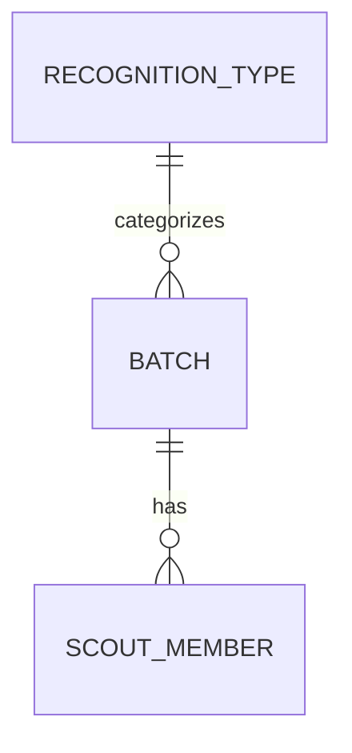

# Active Engineering Context: Chil

Welcome to the active developer context for **Chil**. This document serves as the live handover file between engineering agent sessions. Keep it concise, high-level, and accurate. 

> [!IMPORTANT]
> **DO NOT write micro-task checklists or commit lists here.** Keep this file focused on architectural milestones, schemas, interfaces, and design decisions.

---

## 1. Current Engineering State

* **Frontend (`src/`)**: 100% functional React 19 single-page-app with client-side routing under `react-router-dom` and official `CHIL_LOGO.png` favicon. Features a premium persistent layout, statistical dashboards, cascading hierarchy selection modals, and parallel scraping status checks.
* **Módulo de Lotes & Vistas (`src/features/batches`)**:
  * **Nuevo Lote Wizard**:
    * **Step 1 (Organización)**: Cascading selection logic for Regions, Districts, and Groups using static hierarchy data and premium button-based search modals. Form validation with Zod and React Hook Form.
    * **Step 2 (Miembros & Verificación)**: Bulk verification via parallel async scraper calls (`getMemberStatus`). Commits successful active scouts to Firestore (`scout_members` collection) and flags pending registrations.
    * **Step 3 (Revisión)**: Search filters, validation tab sorting, and manual edit modal allowing correction of member records.
  * **Visualización de Lotes (`BatchList.tsx` / US-04)**:
    * Top KPI cards displaying Total Generado and most frequent recognition type.
    * Dynamic active filter chips bar with removal and addition controls.
    * Full TanStack Table with pagination, formatted issuance dates, hierarchy names, styled recognition badges, and batch action dropdowns/buttons.
    * Integrated batch deletion modal confirming deletion, removing from local state, and providing toast alerts.
  * **Detalle de Lote (`BatchDetail.tsx` / US-05)**:
    * Top 3 cards displaying Detalles del Lote, Tipo de Reconocimiento, and Resumen de Miembros (Adultos, Jóvenes, Sin registrar alert).
    * Members TanStack table with live search, valid/invalid badges, recognition codes, numbered pagination, quick-view modal, and edit modal.
    * Action toolbar with structured CSV list export, client-side PDF generation (`generateBatchReport`), and batch deletion action with redirect to `/lotes`.
  * **Pantalla de Éxito**: Post-creation metrics summary and direct PDF download.
* **Módulo de Reconocimientos (`src/features/recognitions` / US-08A, US-08B & US-08C)**:
  * **Catálogo & TanStack Table (`RecognitionCatalog.tsx` / US-08A)**: Full catalog view displaying recognition name, creation date, action buttons, and a clean empty state with quick creation trigger when no recognitions are registered.
  * **Búsqueda**: Real-time global search with quick clear button.
  * **Modales CRUD**: `RecognitionFormModal` with reactive Zod validation for creating and editing recognition names, and `RecognitionDeleteModal` for secure deletion confirmation and Toast alerts.
  * **Diseñador Visual de Plantillas (`CertificateDesigner.tsx` / US-08B)**: Interactive drag-and-drop certificate template designer supporting dynamic aspect ratios and resolution adaptability (16:9, 4:3, standard A4 297×210 mm, custom uploaded dimensions without distortion/letterboxing), 1:1 WYSIWYG proportional font scaling relative to document point width (`canvasPixelWidth / (docWidthMm * 72 / 25.4)`), ergonomic 2-column workspace layout (spacious Left Canvas Area `lg:col-span-8`, Right Control Panel Sidebar `lg:col-span-4`), clean header bar displaying only the recognition name, icon-only edit/preview mode switcher with accessible titles and aria-labels, format indicator bar positioned directly below the canvas box for maximum vertical canvas room, 3-tab sidebar (`Campos`, `Estilo`, `Fondo`), auto-opening properties inspector upon selecting or clicking any field on the canvas or palette, live typography/color/alignment properties inspector, custom background image uploads with client-side Canvas WebP/JPEG compression, background removal from the Fondo tab, normalized print dimensions display, and realistic scout mock data preview mode.
  * **Motor Dinámico de Diplomas en PDF (`certificatePdfGenerator.ts` / US-08C)**: Dedicated client-side certificate generation service built with `jsPDF`. Supports single certificate generation/download (`generateSingleCertificatePdf`, `downloadSingleCertificatePdf`) and multi-page batch certificate export (`generateBatchCertificatesPdf`). Normalizes any resolution background to physical millimeter print dimensions (`getNormalizedPageDimensions`: e.g. 229.53×297 mm portrait, 297×167.06 mm landscape, 297×210 mm A4) while preserving aspect ratio and preventing microscopic font rendering. Handles custom background injection (`WEBP`, `PNG`, `JPEG`) or fallback official double-bordered layout with watermark, exact coordinate mapping `(x, y)` in percentage of canvas dimensions, vertical centering alignment using `baseline: 'middle'` matching the visual designer's CSS `-50%` vertical centering, custom font families (`helvetica`, `times`, `courier`), font weights (`normal`, `bold`, `italic`), font sizes, hex-to-RGB color mapping, and complete interpolation of scout parameters (`full_name`, `identity`, `recognition_name`, `region`, `district`, `group`, `issue_date`, `recognition_code`). Multi-page exports automatically filter only active scouts (`status === 'active'`) and name files as `Diplomas_Lote_<batchId>_<slug>.pdf`.
* **Backend (`functions/` & `src/lib/firebase.ts`)**: Relies entirely on a serverless backend using Firebase Firestore, Cloud Functions, and Firebase Hosting. No local SQLite database connection or native desktop runner is used.
* **Test Coverage**: Frontend test coverage configured using `@vitest/coverage-v8`, running on Vitest with 100% test pass rate across 22 test suites and 152 unit tests.

---

## 2. Active Database Schema & Models

Our data is stored relationally inside **Firebase Firestore**:

### Collections & Schema Structures

* **`batches`**: Group submissions to the registry. Document IDs match their generated numeric IDs.
  * `id`: `number` (Numeric ID)
  * `comment`: `string` (Optional)
  * `region_id`: `number`
  * `district_id`: `number`
  * `group_id`: `number`
  * `recognition_type`: `string` (Optional)
  * `recognition_duration`: `string` (Optional)
  * `created_at`: `string` (ISO Timestamp)
* **`scout_members`**: Individual scout registrations. Document IDs are keyed by the unique national ID (`identity` / cédula).
  * `identity`: `string` (Unique Cédula)
  * `first_names`: `string`
  * `last_names`: `string`
  * `birth_date`: `string`
  * `email`: `string` (Optional)
  * `phone`: `string` (Optional)
  * `status`: `string` (`"active"` or `"pending"`)
  * `member_type`: `string` (`"young"` or `"adult"`)
  * `recognition_code`: `string` (Optional)
  * `batch_id`: `number` (Reference to the parent `batch.id`)
* **`recognition_types`**: Catalog of scout recognition awards, condecorations, and certificates. Document IDs are normalized slugs (`sct-<slug>`).
  * `id`: `string` (Unique slug ID, e.g. `sct-wood-badge`)
  * `name`: `string`
  * `created_at`: `string` (ISO Timestamp)
  * `template`: `CertificateTemplate` (Optional)
    * `background_url`: `string` (Data URL or storage URL)
    * `page_width`: `number` (Uploaded natural width or 297 mm)
    * `page_height`: `number` (Uploaded natural height or 210 mm)
    * `aspect_ratio`: `number` (width / height ratio, e.g. 1.777, 1.414)
    * `orientation`: `'landscape' | 'portrait'`
    * `fields`: `RecognitionFieldConfig[]`
      * `id`: `string`
      * `field_key`: `RecognitionFieldKey` (`'full_name' | 'identity' | 'region' | 'district' | 'group' | 'issue_date' | 'recognition_code' | 'recognition_name'`)
      * `label`: `string`
      * `x`: `number` (Position X in %)
      * `y`: `number` (Position Y in %)
      * `font_family`: `'helvetica' | 'times' | 'courier'`
      * `font_size`: `number` (10 - 48 pt)
      * `font_weight`: `'normal' | 'bold' | 'italic'`
      * `color`: `string` (hex code)
      * `align`: `'left' | 'center' | 'right'`
* **Firestore Hierarchy Data**: Region, District, and Group information is fetched dynamically from Firestore collections (`regions`, `districts`, `groups`). The database is auto-seeded with static data on the very first load if these collections are empty.

---

## 3. Implemented API / Functions Surface

Below are the active Firebase endpoints exposed to the application:

### HTTPS Callable Cloud Functions
*   `loginScraper({ credentials }) -> Promise<{ success: true }>`: Authenticates cookie session for external scout registry.
*   `getMemberStatus({ cedula, credentials }) -> Promise<MemberDetails>`: Scrapes and returns member profile status from the registry.

### Firestore API & Services Wrappers

#### Batches API (`src/features/batches/api/index.ts`)
*   `getHierarchyData() -> Promise<HierarchyData>`: Queries Firestore collections with auto-seeding script fallback.
*   `createBatch(params) -> Promise<Batch>`: Inserts a new batch document into Firestore.
*   `updateBatch(id, params) -> Promise<Batch>`: Updates an existing batch document in Firestore.
*   `getMembersByBatchId(batchId) -> Promise<ScoutMember[]>`: Queries members associated with a specific batch.
*   `getAllBatches() -> Promise<Batch[]>`: Retrieves all batches, sorted by creation date descending.
*   `getAllMembers() -> Promise<ScoutMember[]>`: Retrieves all scout members across batches.
*   `getBatchById(id) -> Promise<Batch | null>`: Retrieves a single batch by numeric ID.
*   `deleteBatch(batchId) -> Promise<void>`: Atomically deletes a batch and all its associated scout members from Firestore.
*   `createMember(member) / updateMember(member) -> Promise<ScoutMember>`: Performs safe upserts to Firestore using the member's `identity` as the document key.
*   `deleteMember(identity) -> Promise<void>`: Deletes a member record from Firestore.
*   `exportMembersToCSV(batch, members) -> void`: Generates and triggers browser download of member lists in CSV format with UTF-8 BOM.
*   `generateBatchReport(batchId) -> Promise<string>`: Generates a multi-page PDF batch tabular report client-side using `jsPDF` and saves it.

#### Recognitions API & PDF Generator (`src/features/recognitions/`)
*   `getAllRecognitionTypes() -> Promise<RecognitionType[]>`: Retrieves all recognition types, returning an empty array `[]` when the collection is empty without auto-seeding.
*   `getRecognitionTypeById(id) -> Promise<RecognitionType | null>`: Retrieves a single recognition type document.
*   `createRecognitionType(data) -> Promise<RecognitionType>`: Generates clean slug ID and writes new recognition document.
*   `updateRecognitionType(id, data) -> Promise<RecognitionType>`: Updates fields on an existing recognition document.
*   `deleteRecognitionType(id) -> Promise<void>`: Deletes a recognition document from Firestore.
*   `saveCertificateTemplate(recognitionId, template) -> Promise<void>`: Persists certificate template configuration to Firestore.
*   `processBackgroundImageFile(file) -> Promise<ProcessedBackgroundResult>`: Compresses and optimizes background images client-side via Canvas, extracting natural dimensions, normalized print dimensions, orientation, and aspect ratio.
*   `generateRecognitionId(name) -> string`: Normalizes names and generates clean `sct-<slug>` IDs.
*   `getNormalizedPageDimensions(template) -> NormalizedPageDimensions`: Calculates physical millimeter page sizes for standard A4 or custom aspect-ratio backgrounds.
*   `generateSingleCertificatePdf(params) -> Promise<jsPDF>`: Renders a single diploma PDF document instance for a member.
*   `downloadSingleCertificatePdf(params) -> Promise<string>`: Generates and triggers download of a single member certificate PDF.
*   `generateBatchCertificatesPdf(params) -> Promise<string>`: Generates and downloads multi-page PDF certificates for all active batch members.

---

## 4. Key Design Decisions

1.  **Scraper Session Caching**: The scraper cookie jar is cached in-memory inside the Node.js module context (`functions/scraper/auth.js`). Sessions are keyed by credentials to avoid repeating the login handshake.
2.  **Client-Side PDF & CSV Generation**: Replaced backend Rust PDF generation with `jsPDF` and dynamic CSV Blob download directly on the frontend, removing binary compilation overhead and allowing direct browser file downloads without server roundtrips.
3.  **Firestore Hierarchy & Recognition Database**: Replaced static client-side lookups with live Firestore collection queries (`regions`, `districts`, `groups`, `recognition_types`). Integrated self-healing client-side seeding on empty database status for organization hierarchy, while recognition types remain purely user-managed with clear empty states.
4.  **UI Verification Purge**: Configured Step 2 verification list and Firestore sync to immediately hide and purge entries removed from input text fields, ensuring only currently visible records persist.
5.  **SonarQube Scan & Coverage**: Integrated static code analysis and test coverage metrics into the CI pipeline (via `@vitest/coverage-v8` lcov exports) to verify quality thresholds on every pull request.
6.  **Firestore Document ID Keys for Upserts**: In Firestore, `scout_members` are saved using their unique national ID (`identity`) as the Document ID. This ensures `createMember` and `updateMember` act as safe upserts rather than duplicating records or throwing index conflicts.
7.  **Dynamic Visual Coordinate-Based Template Designer & PDF Engine**: Uses percentage-based coordinates `(x, y)` relative to a responsive dynamic aspect-ratio canvas (adaptable to 16:9, 4:3, 3:2, A4, or custom uploaded image dimensions) with an ergonomic 2-column workspace layout (Canvas on the left `lg:col-span-8`, Control Panel Sidebar on the right `lg:col-span-4`), seamlessly matching millimeter-based output in `jsPDF` with explicit `baseline: 'middle'` matching the CSS `-50%` vertical centering.

---

## 5. Next Architectural Milestones

1.  **PDF Certificate Interactive Previews**: Introduce interactive modal previews of generated certificates directly in the browser UI prior to download.
2.  **Exportación a Formatos Gráficos Adicionales**: Support PNG/SVG high-resolution single certificate export.
3.  **Expand Test Coverage**: Maintain Vitest statement coverage above 80%.

