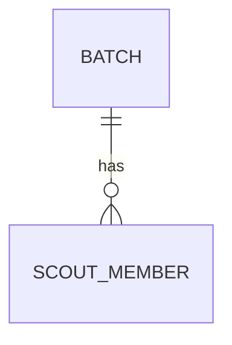

# Active Engineering Context: Chil

Welcome to the active developer context for **Chil**. This document serves as the live handover file between engineering agent sessions. Keep it concise, high-level, and accurate. 

> [!IMPORTANT]
> **DO NOT write micro-task checklists or commit lists here.** Keep this file focused on architectural milestones, schemas, interfaces, and design decisions.

---

## 1. Current Engineering State

* **Frontend (`src/`)**: 100% functional React 19 single-page-app with client-side routing under `react-router-dom`. Features a premium persistent layout, statistical dashboards, cascading hierarchy selection modals, and parallel scraping status checks.
* **Módulo de Lotes & Vistas (`src/features/batches`)**:
  * **Nuevo Lote Wizard**:
    * **Step 1 (Organización)**: Cascading selection logic for Regions, Districts, and Groups using static hierarchy data and premium button-based search modals. Form validation with Zod and React Hook Form.
    * **Step 2 (Miembros & Verificación)**: Bulk verification via parallel async scraper calls (`getMemberStatus`). Commits successful active scouts to Firestore (`scout_members` collection) and flags pending registrations.
    * **Step 3 (Revisión)**: Search filters, validation tab sorting, and manual edit modal allowing correction of member records.
  * **Visualización de Lotes (`BatchList.tsx` / US-04)**:
    * Top KPI cards displaying Total Generado and most frequent recognition type.
    * Dynamic active filter chips bar with removal and addition controls.
    * Full TanStack Table with pagination, formatted issuance dates, hierarchy names, styled recognition badges, and batch action dropdowns/buttons.
    * Integrated batch deletion modal confirming deletion, removing from local state, and providing toast alerts.
  * **Detalle de Lote (`BatchDetail.tsx` / US-05)**:
    * Top 3 cards displaying Detalles del Lote, Tipo de Reconocimiento, and Resumen de Miembros (Adultos, Jóvenes, Sin registrar alert).
    * Members TanStack table with live search, valid/invalid badges, recognition codes, numbered pagination, quick-view modal, and edit modal.
    * Action toolbar with structured CSV list export, client-side PDF generation (`generateBatchReport`), and batch deletion action with redirect to `/lotes`.
  * **Pantalla de Éxito**: Post-creation metrics summary and direct PDF download.
* **Backend (`functions/` & `src/lib/firebase.ts`)**: Relies entirely on a serverless backend using Firebase Firestore, Cloud Functions, and Firebase Hosting. No local SQLite database connection or native desktop runner is used.
* **Test Coverage**: Frontend test coverage configured using `@vitest/coverage-v8`, running on Vitest with 100% test pass rate across 18 test suites and 91 unit tests.

---

## 2. Active Database Schema & Models

Our data is stored relationally inside **Firebase Firestore**:

### Collections & Schema Structures

* **`batches`**: Group submissions to the registry. Document IDs match their generated numeric IDs.
  * `id`: `number` (Numeric ID)
  * `comment`: `string` (Optional)
  * `region_id`: `number`
  * `district_id`: `number`
  * `group_id`: `number`
  * `recognition_type`: `string` (Optional)
  * `recognition_duration`: `string` (Optional)
  * `created_at`: `string` (ISO Timestamp)
* **`scout_members`**: Individual scout registrations. Document IDs are keyed by the unique national ID (`identity` / cédula).
  * `identity`: `string` (Unique Cédula)
  * `first_names`: `string`
  * `last_names`: `string`
  * `birth_date`: `string`
  * `email`: `string` (Optional)
  * `phone`: `string` (Optional)
  * `status`: `string` (`"active"` or `"pending"`)
  * `member_type`: `string` (`"young"` or `"adult"`)
  * `recognition_code`: `string` (Optional)
  * `batch_id`: `number` (Reference to the parent `batch.id`)
* **Firestore Hierarchy Data**: Region, District, and Group information is fetched dynamically from Firestore collections (`regions`, `districts`, `groups`). The database is auto-seeded with static data on the very first load if these collections are empty.

---

## 3. Implemented API / Functions Surface

Below are the active Firebase endpoints exposed to the application:

### HTTPS Callable Cloud Functions
*   `loginScraper({ credentials }) -> Promise<{ success: true }>`: Authenticates cookie session for external scout registry.
*   `getMemberStatus({ cedula, credentials }) -> Promise<MemberDetails>`: Scrapes and returns member profile status from the registry.

### Firestore API Wrapper (`src/features/batches/api/index.ts`)
*   `getHierarchyData() -> Promise<HierarchyData>`: Queries Firestore collections with auto-seeding script fallback.
*   `createBatch(params) -> Promise<Batch>`: Inserts a new batch document into Firestore.
*   `updateBatch(id, params) -> Promise<Batch>`: Updates an existing batch document in Firestore.
*   `getMembersByBatchId(batchId) -> Promise<ScoutMember[]>`: Queries members associated with a specific batch.
*   `getAllBatches() -> Promise<Batch[]>`: Retrieves all batches, sorted by creation date descending.
*   `getAllMembers() -> Promise<ScoutMember[]>`: Retrieves all scout members across batches.
*   `getBatchById(id) -> Promise<Batch | null>`: Retrieves a single batch by numeric ID.
*   `deleteBatch(batchId) -> Promise<void>`: Atomically deletes a batch and all its associated scout members from Firestore.
*   `createMember(member) / updateMember(member) -> Promise<ScoutMember>`: Performs safe upserts to Firestore using the member's `identity` as the document key.
*   `deleteMember(identity) -> Promise<void>`: Deletes a member record from Firestore.
*   `exportMembersToCSV(batch, members) -> void`: Generates and triggers browser download of member lists in CSV format with UTF-8 BOM.
*   `generateBatchReport(batchId) -> Promise<string>`: Generates a multi-page PDF batch report client-side using `jsPDF` and saves it.

---

## 4. Key Design Decisions

1.  **Scraper Session Caching**: The scraper cookie jar is cached in-memory inside the Node.js module context (`functions/scraper/auth.js`). Sessions are keyed by credentials to avoid repeating the login handshake.
2.  **Client-Side PDF & CSV Generation**: Generated directly in the browser via `jsPDF` and dynamic CSV Blob download, avoiding server roundtrips.
3.  **Firestore Hierarchy Database**: Replaced static client-side JSON lookups with live Firestore collection queries (`regions`, `districts`, `groups`). Integrated self-healing client-side seeding on empty database status to keep layout collections manageable via the console.
4.  **UI Verification Purge**: Configured Step 2 verification list and Firestore sync to immediately hide and purge entries removed from input text fields, ensuring only currently visible records persist.
5.  **SonarQube Scan & Coverage**: Integrated static code analysis and test coverage metrics into the CI pipeline (via `@vitest/coverage-v8` lcov exports) to verify quality thresholds on every pull request.
6.  **Firestore Document ID Keys for Upserts**: In Firestore, `scout_members` are saved using their unique national ID (`identity`) as the Document ID. This ensures `createMember` and `updateMember` act as safe upserts rather than duplicating records or throwing index conflicts.

---

## 5. Next Architectural Milestones

1.  **Módulo de Reconocimientos (M4)**: Implement tracking for scout recognition awards, categories, and badge printing templates.
2.  **PDF Report Previews**: Introduce interactive PDF preview modals in the client-side UI before downloading files.
3.  **Expand Test Coverage**: Maintain Vitest statement coverage above 80%.
