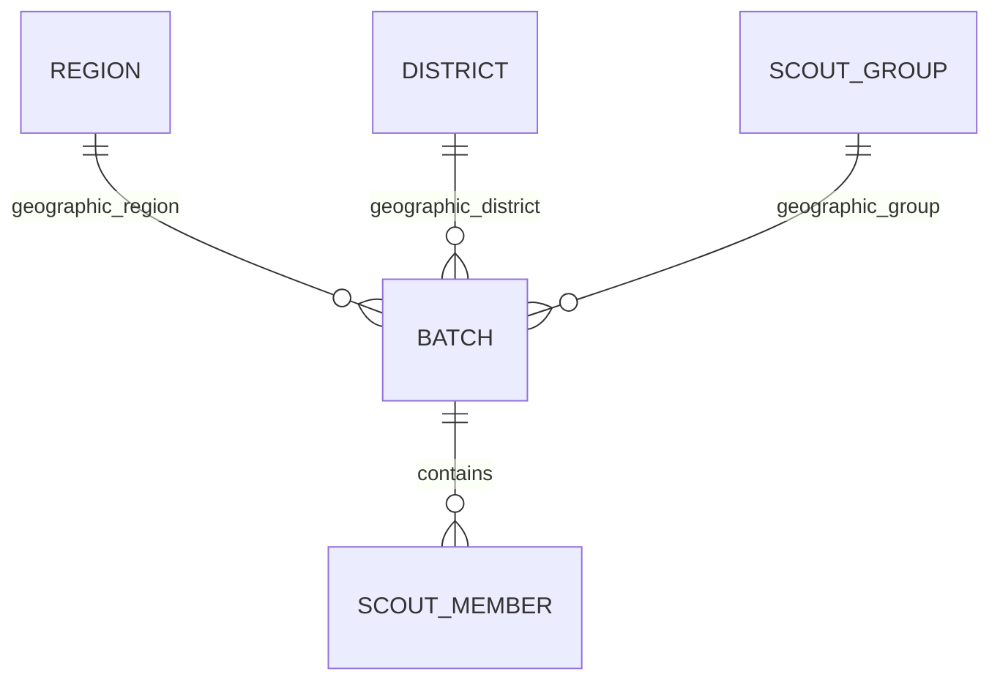

# Feature Context: Batch Management & PDF Generation

This document details the backend architecture, database schemas, service logic, and IPC command interface for the **Módulo de Nuevo Lote (Milestone v0.6.0)**.

---

## 1. High-Level Purpose & Domain Logic

The **Batch (Lote)** represents a formal submission of cached local scout membership records back to the national Scout Association registry. It groups members of a specific geographic Scout Group for verification and bulk registration.

*   **Hierarchy Resolution**: Scout organization data is structured relationally as: `Region` -> `District` -> `ScoutGroup`. The application exposes a pre-structured hierarchy model so the frontend can populate cascading select fields instantly.
*   **Batch Isolation**: Creating a batch auto-selects and links all local `"active"` scout members who belong to that `ScoutGroup`, assigning them the newly created `batch_id`.
*   **Relational Reporting**: Generating a batch report aggregates information across `batch`, `region`, `district`, `scout_group`, and `scout_member` tables to construct a multi-page, formatted PDF.

---

## 2. Relational Schemas & Models

### Database Schema (SeaORM Entities)

We added `batch` and updated `scout_member` to support a foreign key to `batch`:



#### `src/db/entities/batch.rs` (Batch Model)
*   `id`: `i32` (Auto Increment, Primary Key)
*   `name`: `String` (Name of the batch submission)
*   `region_id`: `i32` (Foreign key to `region`)
*   `district_id`: `i32` (Foreign key to `district`)
*   `group_id`: `i32` (Foreign key to `scout_group`)
*   `created_at`: `String` (`YYYY-MM-DD HH:MM:SS` local creation time)

#### `src/db/entities/scout_member.rs` (Scout Member Model)
*   Added `batch_id`: `Option<i32>` (Null-by-default, foreign key to `batch`) to relate cached members to their corresponding batch submission.

---

## 3. Pure Service Layer (`src/services/`)

All services are completely decoupled from Tauri state or app boundaries, receiving a reference to `&DatabaseConnection`.

### Batch Service (`services/batch_service.rs`)
*   `get_hierarchy_data(db) -> Result<HierarchyData, DbErr>`: Builds and returns a structured tree representing the full organizational layout of regions, districts, and groups.
*   `create_batch(db, name, region_id, district_id, group_id) -> Result<Batch, DbErr>`: Creates the batch entity and automatically associates all local active members of that group who are not part of other batches.
*   `get_batch_details(db, batch_id) -> Result<Option<BatchDetails>, DbErr>`: Aggregates the batch metadata, region, district, group, and lists all members associated with the batch.

### PDF Report Service (`services/pdf_service.rs`)
*   `generate_batch_report(db, batch_id, output_path) -> Result<String, String>`: Aggregates details from the batch, formats metadata fields, sanitizes Spanish glyphs (e.g. `á` -> `a`, `ñ` -> `n`) for Helvetica compatibility, builds A4 print pages with dynamic multi-page table wrapping, and outputs a binary PDF document to `output_path`.

---

## 4. Exposed IPC Commands Surface

All IPC handlers map Tauri frontend calls safely to services, deserializing inputs and mapping error domains:

### 1. `get_hierarchy_data`
*   **Rust**: `pub async fn get_hierarchy_data(state: State<'_, AppState>) -> Result<HierarchyData, String>`
*   **JS Invoke**: `invoke("get_hierarchy_data")`
*   **Response Shape**:
    ```typescript
    interface HierarchyData {
      regions: Array<{
        id: number;
        name: string;
        districts: Array<{
          id: number;
          name: string;
          region_id: number;
          groups: Array<{
            id: number;
            name: string;
            district_id: number;
          }>
        }>
      }>
    }
    ```

### 2. `create_batch`
*   **Rust**: `pub async fn create_batch(state: State<'_, AppState>, name: String, region_id: i32, district_id: i32, group_id: i32) -> Result<Batch, String>`
*   **JS Invoke**: `invoke("create_batch", { name, regionId, districtId, groupId })`
*   **Response Shape**:
    ```typescript
    interface Batch {
      id: number;
      name: string;
      region_id: number;
      district_id: number;
      group_id: number;
      created_at: string;
    }
    ```

### 3. `generate_batch_report`
*   **Rust**: `pub async fn generate_batch_report(state: State<'_, AppState>, batch_id: i32, output_path: String) -> Result<String, String>`
*   **JS Invoke**: `invoke("generate_batch_report", { batchId, outputPath })`
*   **Response Shape**: `string` (returns the saved PDF's absolute output path)

---

## 5. Integration Tips for Next Session

1.  **Cascading Selects**: Use the data tree returned by `get_hierarchy_data` in the frontend select components, setting up state variables that filter districts based on selected region, and groups based on selected district.
2.  **PDF Report Downloads**: Use Tauri's `@tauri-apps/plugin-dialog` or `@tauri-apps/api/path` to let the user select a target output directory, then invoke `generate_batch_report` with the chosen absolute output path.
