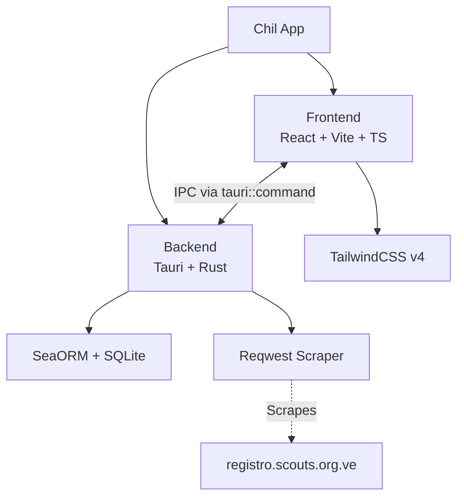

# Chil — Repository Report

> **Repository**: [MiguelCiav/chil](https://github.com/MiguelCiav/chil)
> **Current Version**: `0.3.0`
> **License**: GNU General Public License v3 (GPLv3)
> **Active Branch**: `feat/ci-cd-consolidation` (With local uncommitted changes for backend features)

---

## 1. Overview

**Chil** is a cross-platform native desktop application (macOS, Windows, Linux) designed to **automate and streamline scout recognition workflows**. It enables cooperators to:

- Verify active registrations via automated web scraping of the national registry (`registro.scouts.org.ve`)
- Maintain a local, normalized database of regions, districts, groups, units, and scout members
- Manage records and track statistical data via SQLite
- (Planned) Generate bulk PDFs by Group, District, and Region

The application follows an **offline-first** philosophy with online synchronization — data is pulled from the web registry but stored and managed locally in an embedded SQLite database.

---

## 2. Technology Stack

### Frontend

| Technology | Version | Purpose |
|---|---|---|
| React | 19.1 | UI framework |
| Vite | 7.0 | Build tool & dev server |
| TypeScript | 5.8 | Type safety |
| TailwindCSS | v4 | Styling |
| TanStack Table | 8.21 | Data table management |
| React Hook Form | 7.75 | Form handling |
| Zod | 4.4 | Schema validation |
| Lucide React | 1.14 | Icon library |
| React Router DOM | 7.15 | Client-side routing |

### Backend (Native)

| Technology | Version | Purpose |
|---|---|---|
| Tauri | v2 | Desktop app framework (Rust) |
| SeaORM | 1.1.0 | ORM for SQLite |
| Reqwest | 0.12 | Async HTTP client (with cookie store for sessions) |
| Scraper | 0.20 | HTML parsing and DOM querying |
| Tokio | 1.x | Async runtime |
| Serde / Serde JSON | 1.x | Serialization |
| Dotenvy | 0.15 | Environment variable management (for local tests) |

### Development Tooling

| Tool | Purpose |
|---|---|
| Vitest + React Testing Library | Frontend unit/component tests |
| Cargo test + SeaORM Mocks | Backend Rust unit tests & Integration tests |
| WebdriverIO + tauri-driver | End-to-end desktop tests |
| ESLint + typescript-eslint | Frontend linting |
| Cargo Clippy | Rust linting |
| Husky + Commitlint | Git hook enforcement (Conventional Commits) |
| Changesets | Automated versioning & changelog |

---

## 3. Architecture & Directory Structure



### Root-Level Layout (Key Files)

```
chil/
├── src/                  # Frontend source (React/TypeScript)
│   ├── App.tsx           # Root component
│   └── ...               # (Frontend architecture remains scaffolding)
├── src-tauri/            # Backend source (Rust/Tauri)
│   ├── src/
│   │   ├── main.rs       # Tauri app entry; initializes DB, registers all commands
│   │   ├── models.rs     # AppState struct (Shared DB & reqwest::Client)
│   │   ├── commands/     # Tauri IPC command handlers
│   │   │   ├── mod.rs
│   │   │   ├── member.rs # CRUD commands for Scout Members
│   │   │   └── scraper.rs# Login & Data extraction commands
│   │   ├── db/           # Database connection setup
│   │   │   └── mod.rs    # Connection & Auto-table creation on startup
│   │   ├── entities/     # SeaORM Database Models
│   │   │   ├── mod.rs
│   │   │   ├── region.rs
│   │   │   ├── district.rs
│   │   │   ├── scout_group.rs
│   │   │   ├── unit.rs
│   │   │   └── scout_member.rs
│   │   └── services/     # Business logic modules
│   │       ├── mod.rs
│   │       ├── member_service.rs  # DB CRUD implementation
│   │       └── scraper_service.rs # Web scraping & parsing logic
│   └── Cargo.toml        # Rust dependencies
└── .github/workflows/    # CI/CD pipeline
```

---

## 4. Backend Deep Dive

### Application Bootstrap (`main.rs`)
- Establishes SQLite connection (`sqlite.db`)
- Initializes an HTTP Client with a persistent Cookie Store (crucial for web scraping authentication)
- Registers all Tauri IPC commands (`scraper::login`, `member::create_member`, etc.)
- Launches the native window.

### Database Layer (`db/mod.rs` & `entities/`)
- Auto-creates the SQLite file and dynamically generates all tables (`region`, `district`, `scout_group`, `unit`, `scout_member`) on startup using `Schema::create_table_from_entity` with `if_not_exists()`.
- Implements a normalized, relational database schema mimicking real-world scout organization hierarchies.

### Services (`services/`)
- **`scraper_service.rs`**: Handles authenticating with the national registry, managing session tokens, performing GET requests, and declaratively parsing the HTML DOM into structured `MemberDetails` structs.
- **`member_service.rs`**: Core SeaORM logic abstracting all CRUD operations (Create, Read, Update, Delete) for the local database representations.

### Commands (`commands/`)
- Thin wrappers mapping Tauri's IPC mechanism directly to internal asynchronous services, seamlessly serializing/deserializing Rust structs into frontend-compatible JSON.

---

## 5. CI/CD Pipeline

The project uses a **three-stage GitHub Actions pipeline** (Lint & Test -> Release Planner -> Build & Release), featuring a full matrix build compiling native installers for Ubuntu, macOS (Intel & ARM), and Windows.

---

## 6. Current State Assessment

> [!IMPORTANT]
> The backend architecture is now fully realized with a robust scraping engine and a normalized local database. The immediate roadblock is the empty frontend UI.

### ✅ What's Solid
- **Data Acquisition**: Reliable web scraping flow retrieving detailed profiles from external national scout registries.
- **Data Persistence**: Fully normalized local SQLite schema mapped to strict Rust typing with automatic table generation.
- **API Surface**: comprehensive suite of Tauri IPC commands ready to be consumed by the client.
- **Robust CI/CD**: Multi-platform build matrix with automated tests and releases.

### 🚧 What's Pending
- **Frontend UI is empty**: `App.tsx` renders a blank shell.
- **No routing configured**: `react-router-dom` is a dependency but no routes are defined.
- **Integration**: The frontend is entirely disconnected from the now-functional backend commands.
- **PDF Generation**: Still a placeholder concept for the future.

### 📌 Immediate Next Steps
1. **Frontend Foundation**: Establish standard React Router layouts and integrate UI component libraries.
2. **Data Binding**: Build screens that actively invoke `invoke('login')` and `invoke('get_member_status')`.
3. **Synchronization Logic**: Implement UI flows that take scraped data and push it into the local database using the `create_member` commands.
